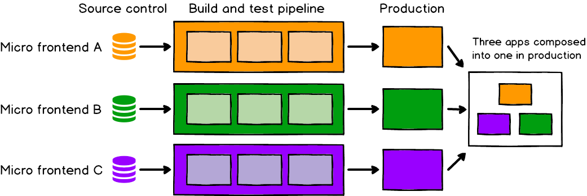
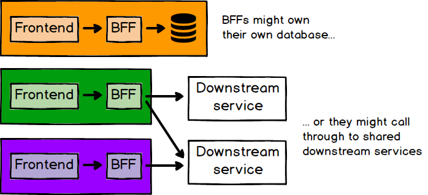

title: Introduction to Microfrontends
class: animation-fade
layout: true


<!-- This slide will serve as the base layout for all your slides -->

---

class: impact full-width

.impact-wrapper[
# {{title}}
]

---

class: center middle


???

- want to answer this 3 questions
- what is a microfrontend
- why would you use it
- how can you get started

---

class: transition

## Mario Fernandez
## Matthias Kainer
 
 **Thought**Works
 
---

class: center middle

## Let's start with some context
 
---

class: center middle

## .bubble[Nov 19] Tech Radar

.bottom-right[
thoughtworks.com/de/radar
]

--

> We've seen significant benefits from introducing microservices, which have allowed teams to scale the delivery of independently deployed and maintained services. Unfortunately, we've also seen many teams create a front-end monolith — a large, entangled browser application that sits on top of the back-end services — largely neutralizing the benefits of microservices. 

--

<hr />

> Micro frontends have continued to gain in popularity since they were first introduced. We've seen many teams adopt some form of this architecture as a way to manage the complexity of multiple developers and teams contributing to the same user experience.

---

class: transition

# A typical scenario

---

class: center middle


???

- We have seen a push to break services into smaller entities that can be maintained more easily
- In many cases, the frontend has remained completely integrated, which many of the issues of monoliths

---

class: transition

# What are microfrontends?

---

class: center middle

## An architectural style where independently deliverable frontend applications are composed into a greater whole

---

class: center middle



.bottom-right[
microfrontends.com
]

---

class: center middle


.bottom-right[
microfrontends.com
]

???

- There is an article from a colleague from us which goes into a lot of detail

---

class: center middle

### martinfowler.com/articles/micro-frontends.html

---

class: transition

# Why use them?

---

class: center middle

## Incremental updates

???

- no big bang releases

---

class: center middle

## Independent deployments

???

- path to production

---

class: center middle

## Autonomous teams

???

- vertical slicing instead of horizontal slicing

---

class: impact

.impact-wrapper[
# A fundamental tradeoff
]

---

class: center middle


???

- Tradeoffs involved
- In order to gain autonomy, we have to sacrifice speed or increase complexity

---

class: center middle

## Not everybody is sold

---

class: center middle


---

class: impact

.impact-wrapper[
# Integration approaches
]

---

class: center middle


---

class: transition center middle

# Build time integration

---

class: center middle

## Divide application into separate npm packages aggregate them and deploy

---

class: center middle


---

class: center middle

## Lerna

.bottom-right[
github.com/lerna/lerna
]

---

class: center middle

```plaintext
lerna.json
package.json
packages/
  main/
  header/
  footer/
  microfrontend1/
  microfrontend2/
```

---

class: center middle

```json
{
  "lerna": "3.15.0",
  "version": "independent",
  "npmClient": "yarn",
  "useWorkspaces": true,
  "packages": ["packages/*"]
}
```

---

class: center middle

## .green[✔] Simple

---

class: center middle

## .red[❌] Independent deployments

---

class: transition center middle

## Server Side Includes

???

- algo Edge Side Includes in Varnish

---

class: center middle

## What is a SSI?

---

class: center middle

> Server Side Includes (SSI) is a simple interpreted server-side scripting language used almost exclusively for the World Wide Web. It is most useful for including the contents of one or more files into a web page on a web server, using its #include directive.

---

class: center middle


```html
<html lang="en" dir="ltr">
  <head>
    <meta charset="utf-8">
    <title>SSI Example</title>
  </head>
  <body>
    <h1>Static header</h1>
    <hr/>
    <!--# include file="$PAGE.html" -->
  </body>
</html>
```

---

```nginx
server {
    listen 8080;
    index index.html;
    ssi on;

    # Decide which HTML fragment to insert based on the URL
    location /browse {
        set $PAGE 'browse';
    }

    location /order {
        set $PAGE 'order';
    }

    location /profile {
        set $PAGE 'profile';
    }
}
```

---

class: center middle

## Where is the microfrontend here?

---

class: center middle


???

- not necessarily a new idea

---

class: center middle

## .green[✔] (Still) Simple

---

class: center middle

## .red[❌] Managing assets

---

class: center middle

### thoughtworks.com/talks/a-high-performmance-solution-to-microservice-ui-composition

---

class: transition center middle

# Server Side Rendering

---

class: center middle

## Example: Hypernova

.bottom-right[
github.com/airbnb/hypernova
]

---

class: transition center middle

# Backend interaction

---

class: center middle

## Backend for frontend

.bottom-right[
samnewman.io/patterns/architectural/bff/
]

---

class: center middle



---

class: center middle

## Avoid coupling

---

class: transition center middle

# CI/CD

---

class: center middle full-width white
background-image: url(images/single-pipeline.png)

---

class: center middle

### github.com/sirech/talks/raw/master/2019-04-tw-build_pipelines.pdf

---

THIS IS THE PRESENTATION BREAK SO THAT WE CAN ADD SLIDES WITHOUT GIT HAVING ISSUES AT THE END OF THE FILE

Let's remember to remove that slide, shall we?

---


