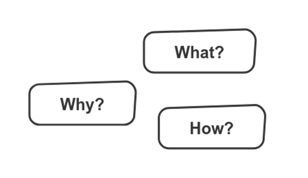
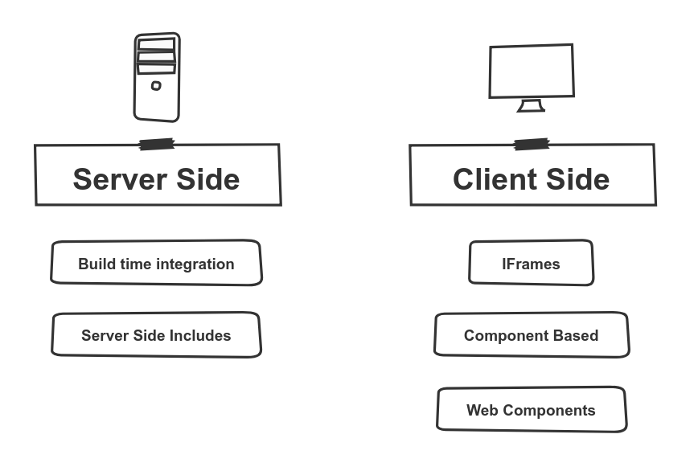
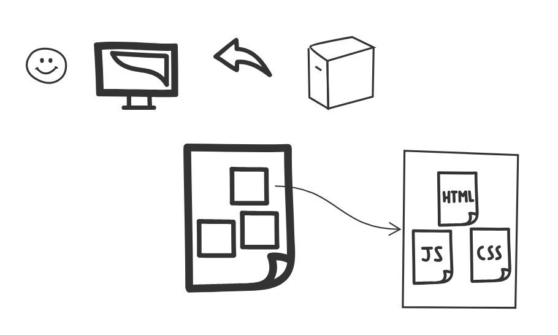

title: Introduction to Microfrontends
class: animation-fade
layout: true


<!-- This slide will serve as the base layout for all your slides -->

---

class: impact full-width

.impact-wrapper[
# {{title}}
]

---

class: center middle



???

- want to answer this 3 questions
- what is a microfrontend
- why would you use it
- how can you get started

---

class: transition

## Mario Fernandez
## Matthias Kainer
 
 **Thought**Works
 
---

class: center middle

## Everybody got into the microservices train

---

class: center middle


???

- You went through all the trouble of adopting microservices, defining boundaries
- Now the frontend remains a monolotih that is hard to deploy

---

class: center middle

.col-6[

]
.col-6.mt-5[
## Release frequency
### Backend: .green[Daily]
### Frontend: .bad-practice[Quarterly]
]

???

- This seems extreme, but it is in fact a setup that we have observed in some of our projects

---

class: center middle

## .bubble[Nov 19] Tech Radar

.bottom-right[
thoughtworks.com/de/radar
]

--

> We've seen significant benefits from introducing microservices, which have allowed teams to scale the delivery of independently deployed and maintained services. Unfortunately, we've also seen many teams create a front-end monolith — a large, entangled browser application that sits on top of the back-end services — largely neutralizing the benefits of microservices. 

--

<hr />

> Micro frontends have continued to gain in popularity since they were first introduced. We've seen many teams adopt some form of this architecture as a way to manage the complexity of multiple developers and teams contributing to the same user experience.

---

class: transition

# What are microfrontends?

---

class: center middle

## An architectural style where independently deliverable frontend applications are composed into a greater whole

---

class: center middle

## From the developers perspective

---

class: center middle


.bottom-right[
microfrontends.com
]

???

- the frontend is now a collection of different apps
- Before being delivered to the end user, it is composed in *some way*
- We'll talk about different ways later

---

class: center middle

## From the users perspective

---

class: center middle


.bottom-right[
microfrontends.com
]

???

- The user should not realize the page is composed by microfrontends

---

class: center middle

### martinfowler.com/articles/micro-frontends.html

???

- There is an article from a colleague from us which goes into a lot of detail

---

class: transition

# Why use them?

---

class: center middle

## Incremental updates

???

- no big bang releases

---

class: center middle

## Independent deployments

???

- path to production

---

class: center middle

## Autonomous teams

???

- vertical slicing instead of horizontal slicing

---

class: transition
# Should you use microfrontends?

---

class: center middle

## Not everybody is sold

---

class: center middle


???

- when the article on Martin Fowler's site appeared, there was a strong pushback on twitter

---

class: center middle


???

- Tradeoffs involved
- In order to gain autonomy, we have to sacrifice speed or increase complexity

---

class: center middle

## Factors to consider

---

class: center middle

## Are your teams...

.col-6[
### Vertically divided
]

.col-6[
### Horizontally divided
]

???

- i.e: divided around products or technical layers

---

class: center middle

## Is your priority...

.col-6[
### Fast time to market
]

.col-6[
### High UX consistency
]

???

- i.e: divided around products or technical layers

---

class: center middle

## Are you releasing your application...

.col-6[
### Once every quarter
]

.col-6[
### Once every hour
]

???

- If you are already at a high level of maturity, you might not need this

---

class: transition

# Integration approaches

---

class: center middle



???

- This are some of the approaches we will be talking about, which have been included in different ways in different projects of us
- additionally, we'll talk about some other relevant concerns when implementing microfrontends

---

class: transition center middle

# Build time integration

---

class: center middle

## Divide the application into separate npm packages, which are deployed as one entity 

---

class: center


---

class: center middle

```json
{
  "name": "@awesome-corp/container",
  "version": "1.0.0",
  "dependencies": {
    "@awesome-corp/search": "^1.2.3",
    "@awesome-corp/profile": "^7.8.9",
    "@awesome-corp/header": "^0.1.2",
    "@awesome-corp/footer": "^0.2.5"
  }
}
```

---

class: center middle

```html
<BrowserRouter>
  <CssBaseline />
  <Header />

  <Box mt={12}>
    <Container component="main">
      <Switch>
        <Route path="/search" component={Search} />
        <Route path="/profile" component={Profile} />
      </Switch>
    </Container>
  </Box>

  <Footer />
</BrowserRouter>
```

---

class: center middle

## Lerna

.bottom-right[
github.com/lerna/lerna
]

???

- monorepo approach is possible

---

class: center middle

```plaintext
lerna.json
package.json
packages/
  main/
  header/
  footer/
  microfrontend1/
  microfrontend2/
```

---

class: center middle

```json
{
  "lerna": "3.15.0",
  "version": "independent",
  "npmClient": "yarn",
  "useWorkspaces": true,
  "packages": ["packages/*"]
}
```

---

class: center middle

## .green[✔] Simple

---

class: center middle

## .red[❌] Independent deployments

---

class: center middle

## Good as a starting point

---

class: transition center middle

## Server Side Includes

???

- algo Edge Side Includes in Varnish

---

class: center middle

## What is a SSI?

---

class: center middle

> Server Side Includes (SSI) is a simple interpreted server-side scripting language used almost exclusively for the World Wide Web. It is most useful for including the contents of one or more files into a web page on a web server, using its #include directive.

---

class: center middle


```html
<html lang="en" dir="ltr">
  <head>
    <meta charset="utf-8">
    <title>SSI Example</title>
  </head>
  <body>
    <h1>Static header</h1>
    <hr/>
    <!--# include file="$PAGE.html" -->
  </body>
</html>
```

---

```nginx
server {
    listen 8080;
    index index.html;
    ssi on;

    # Decide which HTML fragment to insert based on the URL
    location /browse {
        set $PAGE 'browse';
    }

    location /order {
        set $PAGE 'order';
    }

    location /profile {
        set $PAGE 'profile';
    }
}
```

---

class: center middle

## Where is the microfrontend here?

---

class: center middle



???

- not necessarily a new idea

---

class: center middle


---

class: center middle

## .green[✔] (Still) Simple

---

class: center middle

## .red[❌] Managing assets

---

class: center middle

### thoughtworks.com/talks/a-high-performmance-solution-to-microservice-ui-composition

---

class: transition center middle

# Backend interaction

---

class: center middle

## Backend for frontend

.bottom-right[
samnewman.io/patterns/architectural/bff/
]

---

class: center middle

## A custom backend for a particular client
### Tightly coupled
### Owned by the same team

---

class: center middle


---

class: center middle

## Microfrontends talk to their own BFF

???

- makes sense to enforce this rule

---

class: center middle

## Avoids coupling

???

- we don't want to lose the benefits we got from switching to this architecture

---

class: center middle

## Chatty applications make your life harder

???

- you cannot avoid communication between microfrontends, but you can reduce it
- can be a sign of a bad domain boundary

---

class: transition center middle

# CI/CD

---

class: center middle

## Smaller clients => Smaller deployments

---

class: center middle full-width white
background-image: url(images/single-pipeline.png)

---

class: center middle

### github.com/sirech/talks/raw/master/2019-04-tw-build_pipelines.pdf

---

THIS IS THE PRESENTATION BREAK SO THAT WE CAN ADD SLIDES WITHOUT GIT HAVING ISSUES AT THE END OF THE FILE

Let's remember to remove that slide, shall we?

---


